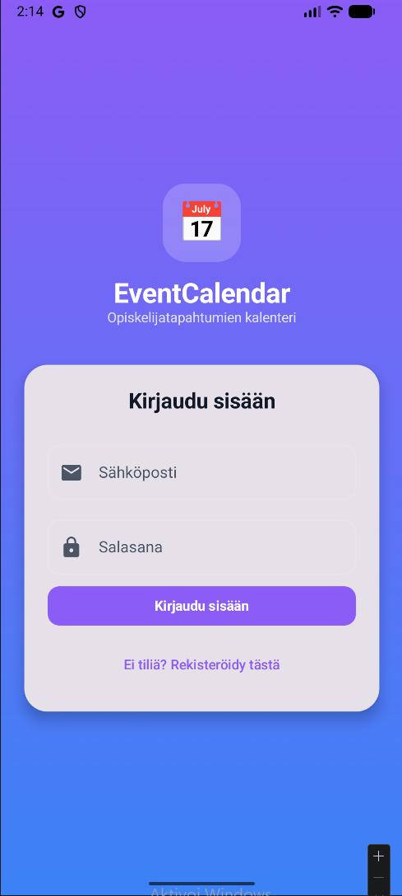
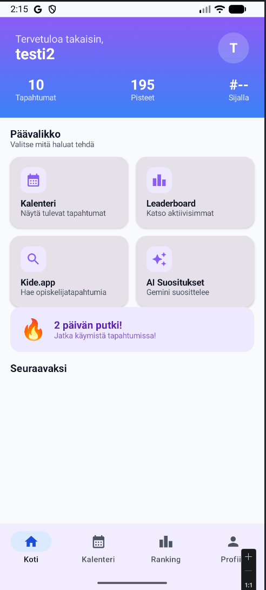
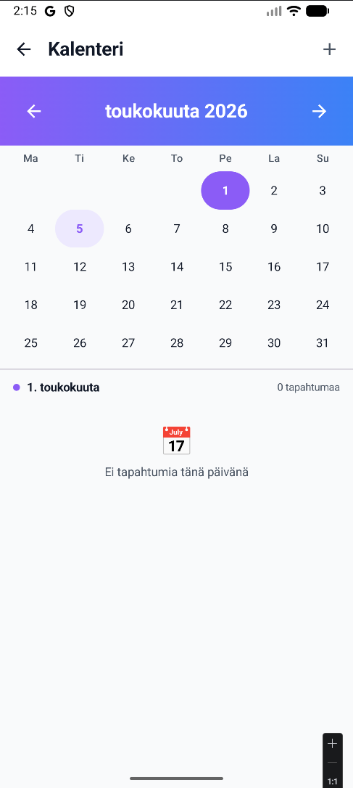
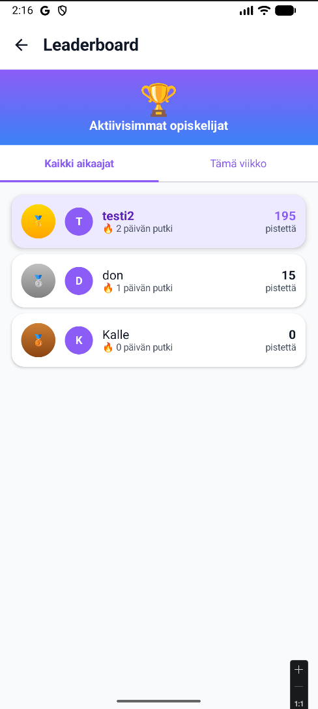
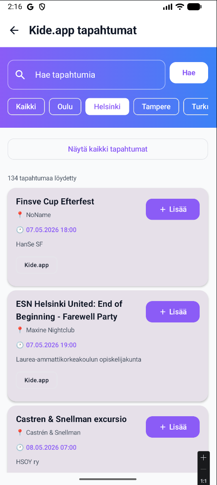
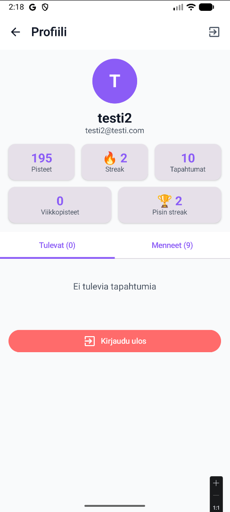
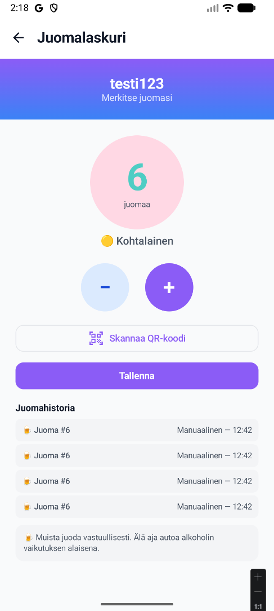

# EventCalendar 📅

> Opiskelijatapahtumien kalenteri — kerää pisteitä, ylläpidä streakkiä ja löydä uusia tapahtumia!


## 📱 Kuvakaappaukset

<p float="left">
  
  
  
  
</p>
<p float="left">
  
  
  
  
</p>

## Projektin kuvaus

EventCalendar on Android-sovellus joka on suunnattu opiskelijoille. Sovelluksen avulla voit:
- Selata ja lisätä tapahtumia kalenteriin
- Ilmoittautua tapahtumiin ja kerätä pisteitä
- Ylläpitää viikkostreakkiä käymällä tapahtumissa säännöllisesti
- Kilpailla muiden opiskelijoiden kanssa leaderboardilla
- Hakea Kide.app tapahtumia suoraan sovellukseen
- Saada AI-pohjaisia tapahtumasuosituksia Gemini AI:lta
- Seurata juomia tapahtumissa QR-koodin avulla

## Ominaisuudet

-  **Kirjautuminen** — Firebase Authentication (sähköposti + salasana)
-  **Kalenteri** — Tapahtumien lisäys, muokkaus ja poisto
-  **Kide.app integraatio** — Hae opiskelijatapahtumia kaupungeittain
-  **Gemini AI** — Henkilökohtaiset tapahtumasuositukset
-  **Streak-systeemi** — Pisteytysjärjestelmä viikottaisella putkella
-  **Leaderboard** — Viikko- ja kokonaisrankingit
-  **Google Maps** — Tapahtumapaikkojen karttaintegraatio
-  **QR-koodi** — Juomalaskuri QR-koodiskannauksella
-  **Profiilisivu** — Tilastot ja tapahtumahistoria
-  **Reaaliaikainen päivitys** — Firestore snapshot listener

##  Teknologiat

| Teknologia | Käyttötarkoitus |
|------------|----------------|
| Kotlin | Ohjelmointikieli |
| Jetpack Compose | UI-kirjasto |
| Firebase Auth | Käyttäjähallinta |
| Firebase Firestore | Tietokanta |
| Hilt | Dependency Injection |
| Google Maps SDK | Karttaintegraatio |
| Gemini AI API | AI-suositukset |
| Kide.app API | Tapahtumat |
| ZXing | QR-koodi skannaus |
| Retrofit | HTTP-pyynnöt |
| Nominatim | Paikkahaku |
| Navigation Compose | Navigaatio |

## 🏗️ Arkkitehtuuri

Sovellus on rakennettu **MVVM-arkkitehtuurilla**:

UI Layer (Jetpack Compose Screens)
↓
ViewModel Layer (State & Business Logic)
↓
Repository Layer (Data Access)
↓
Firebase / REST APIs

### Tiedostorakenne

app/src/main/java/com/example/eventcalendar/
├── di/                    # Hilt Dependency Injection
├── model/                 # Data luokat
├── repository/            # Data access layer
├── ui/
│   ├── ai/               # AI suositukset
│   ├── auth/             # Kirjautuminen
│   ├── calendar/         # Kalenteri
│   ├── components/       # Yhteiset komponentit
│   ├── drinks/           # Juomalaskuri
│   ├── events/           # Tapahtumien hallinta
│   ├── home/             # Kotivalikko
│   ├── kide/             # Kide.app integraatio
│   ├── leaderboard/      # Ranking
│   ├── map/              # Kartta
│   ├── navigation/       # Navigaatio
│   ├── profile/          # Profiili
│   └── theme/            # Teema ja värit
├── utils/                # Apuluokat
└── viewmodel/            # ViewModelit

## 🧪 Testaus

Projektissa on **26 unit testiä**:

```bash
# Aja unit testit
./gradlew test
```

| Testitiedosto | Testien määrä | Kattavuus |
|--------------|---------------|-----------|
| StreakRepositoryTest | 10 | Streak-logiikka, pisteet |
| EventViewModelTest | 8 | Tapahtumien käsittely |
| UserModelTest | 8 | Käyttäjämalli |

## 👥 Tiimi

| Nimi | 
|------|
| Kalle Toivonen |
| Filip Vojnovic |
| Doni Kojovic |
| Sarujan Mathyruban |

**Metropolia Ammattikorkeakoulu**
